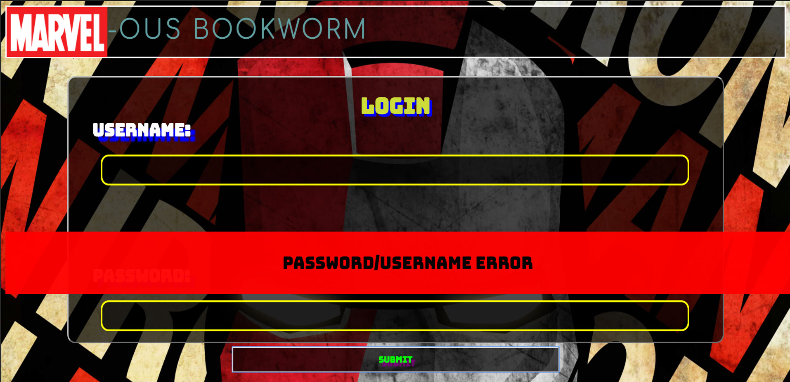
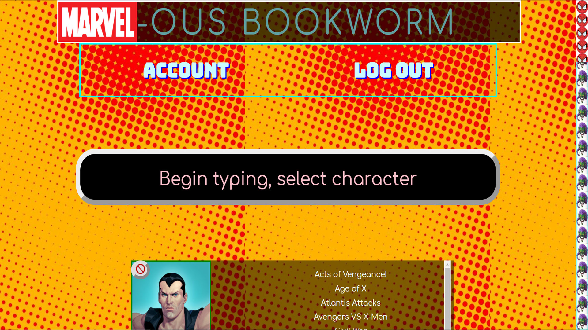
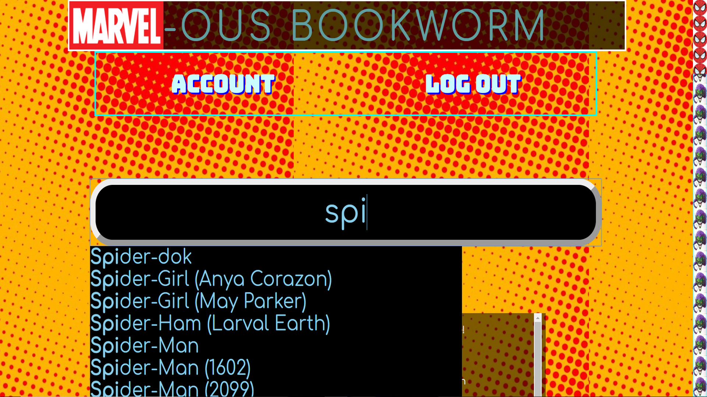
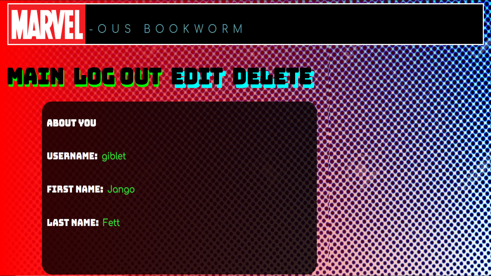
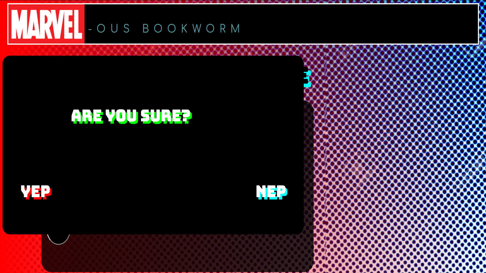

<h1>MarvelousBookworm</h1>

<p><a href='https://shrouded-anchorage-29615.herokuapp.com'>Marvelous Bookworm</a>
My app is called Marvelous Bookworm and is an app that allows users to see the large cross-over events that their favorite characters partake in and where find them for purchase on Amazon.com.</p>

###GETTING STARTED
#Installing
```
>git clone https://github.com/lightsage88/mobius
>cd mobius
>npm install
```

#Launching
```
>npm start
```
Then open [`localhost:8080`](http://localhost:8080) in your browser.

#Testing
```
>npm test
```

<h2>Introduction</h2>
<p>Like many, if not all, nerds, I love comic books. Given how many movies Marvel seems to be putting out and their emphasis on having multiple heroes share the screen together, I thought it might be handy for people to have a tool that would allow them to seek their favorite Marvel characters and get a list of their print versions of their multi-hero escapades.<br>This way, people might get the opportunity to read the original stories of 'Civil War' or the 'Infinity War' and see how Marvel Films and Disney have changed those storylines, as well as be able to read the adventures of characters they may not be as used to, but see in films, like 'Ant-Man' and 'Black Panther'.</p>

<h2>How it works</h2>
<h3>Register</h3>
<p>In order to use the Marvelous Bookworm, you are going to need to make an account. It might seem like a pain, but it will allow you to save your searches to your account so that you can log in right away when you're at a comic book shop and see which characters are in your collection and what cross-over stories you might want to consider picking up if they are on special.<br>Your account can have a username of atleast 1 character, and your password must be at least 6 characters, but no more than 20 characters long.</p>
<h3>Login</h3>
<p>You can log in with the account credentials you set up when creating an account...or you can use the sample account that is provided at the login page</p>
<h3>Home/Search</h3>
<p>This page is the real meat and potatoes of Marvelous Bookworm. You can begin typing and if there is something that matches any character in the Marvel Comics universe, their name will pop down for you to select and add to your collection.<br>Once you do that, the page will reload and if you picked 'Spider-Man', for instance, you'll see a thumbnail of him and a list of the comic book cross-over events that he is a part of. If you click the names of these events, you'll go to an Amazon search result page that will offer you deals to buy that particular comic book story in its entirety.</p>
<h3>Account</h3>
<p>This part of the site lets you observe and change your user information. You can't change your login username or your password, but you can change the first and last name you registered with.</p>

<h2>Screenshots</h2>

Welcome Page/Index.html
- First screen you see, gives you option of signing up or logging in.


Register Page

-what you first see upon choosing to register/signup


-When you begin filling out the registration form...


Login Page

-When there is an error logging in:


Main Page

-what you first see when successfully logging in


-When you begin typing in the search bar, autofill kicks in with what Marvel has to offer and you hover over selections before
clicking them


-what you get sent to when you click a link:


Account Page
-first screen you see when clicking the 'ACCOUNT' link:


-what you see when you click the 'EDIT' text on the Account page. you're given the ability to edit your first and last names:


-a prompt upon pressing 'DELETE' to confirm your choice:


-when you successfully delete an account:


<h2>Technology</h2>
<p>This project utilized express, mocha, chai, bcryptjs (for password hashing), mongoose, passport, and bodyParser.
I built an API with several endpoints that allowed for user account creation, reading, updating, and deleting (CRUD).
The API's schema included a place for a hashed password to be stored, an optional first name and last name, and an array of
'marvelousData' which would hold information needed to render users' favorite characters and the pertinent information regarding their
participation in cross-over comic book events.</p>
<h3>Front End</h3>
<ul>
  <li>HTML5</li>
  <li>CSS3</li>
  <li>JavaScript</li>
  <li>jQuery</li>
</ul>
<h3>Back End</h3>
<ul>
  <li>Bcrypt.js</li>
  <li>Body-Parser</li>
  <li>Express.js</li>
  <li>Json Web Token</li>
  <li>Mocha + Chai + ChaiHttp</li>
  <li>MongoDB/mLab.com</li>
  <li>Mongoose</li>
  <li>Morgan</li>
  <li>Node.js</li>
  <li>Passport + Passport.jwt + Passport.local</li>
  <li>Request</li>
  <li>Continuous integration and deployment with <a href='https://travis-ci.org/'>Travis-CI</a></li>
</ul>


